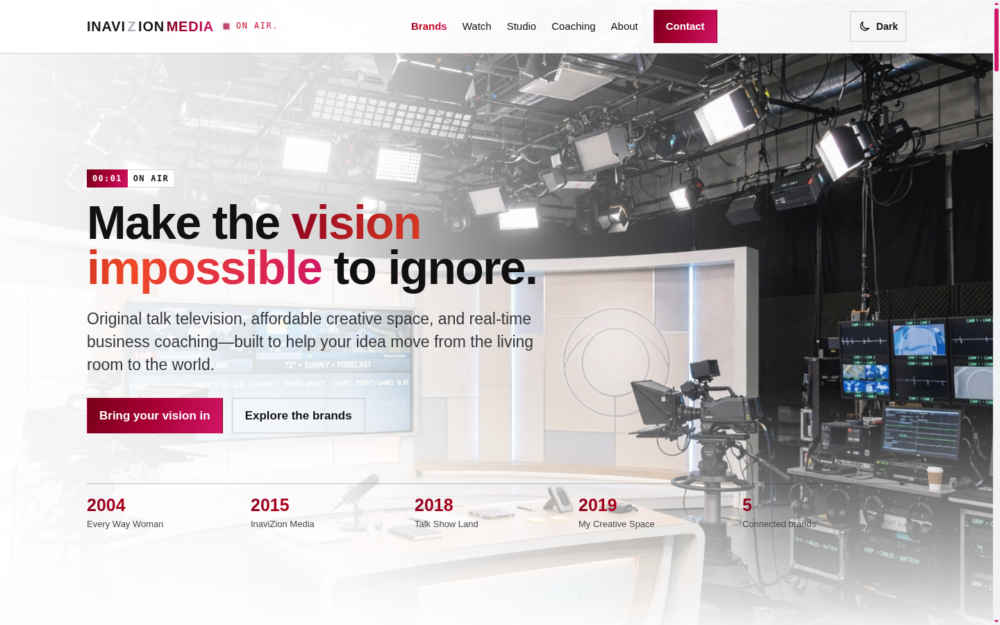
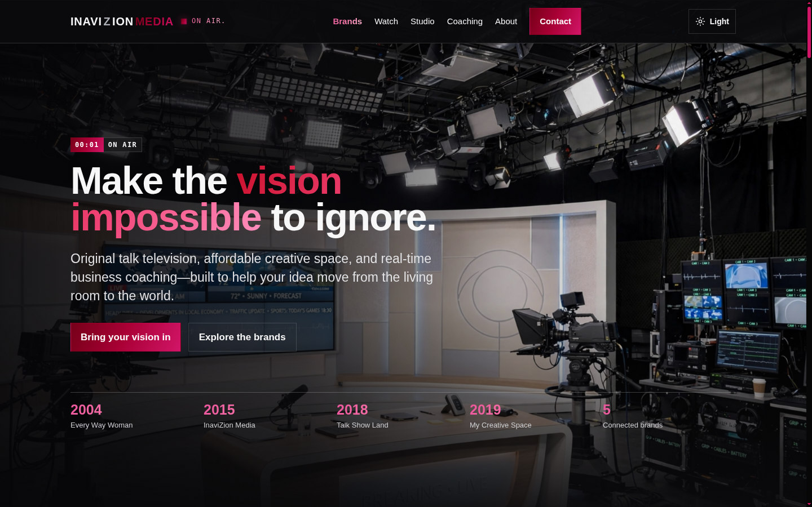

# InaviZion Media — Redesign Draft

> A full redesign draft of **inavizionmedia.com** — Yolando Mitchell Brown's media company: original talk shows, an affordable creative studio, and education for creative entrepreneurs.

[](https://agentzlab.github.io/InavizionMedia-Remake/)
[](https://github.com/agentzlab/InavizionMedia-Remake/commits/redesign-v2)
[](https://github.com/agentzlab/InavizionMedia-Remake)
[](https://agentzlab.github.io/InavizionMedia-Remake/)
[](https://agentzlab.github.io/InavizionMedia-Remake/)

**Live preview:** https://agentzlab.github.io/InavizionMedia-Remake/ (live when a redesign branch merges to `main`; artifact preview available now)

| Light | Dark |
|---|---|
|  |  |

## What's inside

- **Hero** — "Make the vision impossible to ignore." with the **ON AIR.** tally motif, a broadcast chyron eyebrow, and a founding-years timeline (2004 · 2015 · 2018 · 2019); header light/dark toggle (light default)
- **Broadcast ticker** — scrolling chyron strip with the brand names and ON AIR markers
- **Watch theater** — all six YouTube videos from the original site, verified live: one per brand + Yolando's behind-the-scenes; thumbnail cards open a lightbox theater (iframe loads on open, no autoplay, Escape/backdrop close)
- **Five-brand showcase** — Every Way Woman (2004), InaviZion Media (2015), Talk Show Land (2018), My Creative Space (2019, Burbank), Start The Possible — with real handles (@everywaywoman · @inavizionmedia · @talkshowland · @ineedmycreativespace · @startthepossible), each with a "Watch the video" link
- **Studio section** — affordable creative space for filmmakers, photographers, podcasters, artists
- **Coaching section** — Start The Possible: real-time beginner business coaching, no pre-recorded fluff, no upsells
- **Founder story** — Yolando Mitchell Brown: coach, producer, teacher, business owner (@yolandomitchellbrown)
- **FAQ + contact close** — public contact details and the Start The Possible founding year remain `[CONFIRM]` (not harvested)

## Design language

**Light-first broadcast** (Jon's call): the site's accent register is the **dark-pink aurora gradient** (deep red → hot pink, drawn from the Business of Creativity script) — buttons, play marks, timeline years, kickers, aurora headline words, and the footer all carry it. The wordmark is set in **Orbitron** ("INAVIZION" in near-black/white with a silver Z, "MEDIA" in the aurora gradient) in both themes. Display type is Barlow Condensed over Source Sans 3, with broadcast chyron/timecode eyebrows ("00:01 · ON AIR"), a news ticker, tally-light pulse, scroll-spy nav, and a back-to-top control. Sharp edges throughout — deliberately distinct in composition from the sibling Starting Blocks redesign. Generated cinematic imagery, no baked-in text. No invented pricing or testimonials.

## Tech stack

| Layer | Choice |
|---|---|
| Page | Single self-contained `index.html` (light default, dark via header toggle) |
| Hosting | GitHub Pages from `main`, no build step |

## Project structure

```
├── index.html                  # the site (self-contained; light + dark mode)
├── assets/
│   ├── screenshot-light.png    # README hero — light mode (refresh on every build change)
│   └── screenshot-dark.png     # README hero — dark mode (refresh on every build change)
├── docs/
│   ├── CURSOR-BLUEPRINT.md     # builder briefing for future work
│   ├── context-block.md        # live-site harvest (the spec)
│   ├── audit.md                # content audit — no hard conflicts
│   └── decision-log.md         # every design decision, dated
├── .nojekyll
└── README.md
```

## Workflow

- `main` = the live preview. Nothing here touches the live site or goes to Yolando until Jon approves.
- `redesign-v2` = current lead branch (light-first).
- `redesign-v1` = dark charcoal-and-amber alt.
- Redesign mode: the existing site is the spec — fidelity first, deviations flagged.
- Screenshots refresh on every build change — no stale screenshots.
