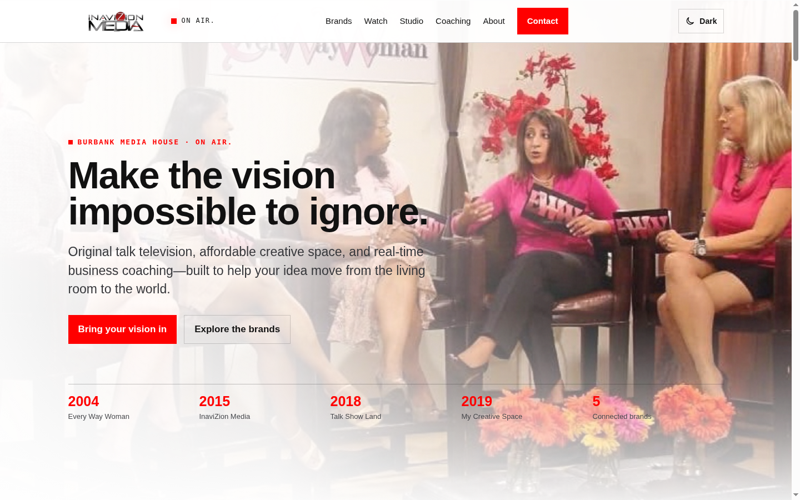

# InaviZion Media — Redesign Draft

> A full redesign draft of **inavizionmedia.com** — Yolando Mitchell Brown's media company: original talk shows, an affordable creative studio, and education for creative entrepreneurs.

[](https://agentzlab.github.io/InavizionMedia-Remake/)
[](https://github.com/agentzlab/InavizionMedia-Remake/commits/redesign-v1)
[](https://github.com/agentzlab/InavizionMedia-Remake)
[](https://agentzlab.github.io/InavizionMedia-Remake/)
[](https://agentzlab.github.io/InavizionMedia-Remake/)

**Live preview:** https://agentzlab.github.io/InavizionMedia-Remake/ (live when `redesign-v1` merges to `main`; artifact preview available now)



## What's inside

- **Hero** — "Make the vision impossible to ignore." with the amber **ON AIR.** tally motif and a founding-years timeline (2004 · 2015 · 2018 · 2019)
- **Five-brand showcase** — Every Way Woman (2004), InaviZion Media (2015), Talk Show Land (2018), My Creative Space (2019, Burbank), Start The Possible — with real handles (@everywaywoman · @inavizionmedia · @talkshowland · @ineedmycreativespace · @startthepossible)
- **Studio section** — affordable creative space for filmmakers, photographers, podcasters, artists
- **Coaching section** — Start The Possible: real-time beginner business coaching, no pre-recorded fluff, no upsells
- **Founder story** — Yolando Mitchell Brown: coach, producer, teacher, business owner (@yolandomitchellbrown)
- **FAQ + contact close** — public contact details and the Start The Possible founding year remain `[CONFIRM]` (not harvested)

## Design language

Dark cinematic broadcast — near-black charcoal, warm amber/gold studio-light accent, recurring ON AIR tally-light motif, condensed broadcast display type (Barlow Condensed) over Source Sans 3. Deliberately distinct from the warm light + red of the sibling Starting Blocks redesign. Generated cinematic imagery, no baked-in text. No invented pricing or testimonials.

## Tech stack

| Layer | Choice |
|---|---|
| Page | Single self-contained `index.html` |
| Hosting | GitHub Pages from `main`, no build step |

## Project structure

```
├── index.html                  # the site (self-contained)
├── assets/
│   └── screenshot.png          # README hero + link-preview image (refresh on every build change)
├── docs/
│   ├── CURSOR-BLUEPRINT.md     # builder briefing for future work
│   ├── context-block.md        # live-site harvest (the spec)
│   ├── audit.md                # content audit — no hard conflicts
│   └── decision-log.md         # every design decision, dated
├── .nojekyll
└── README.md
```

## Workflow

- `main` = the live preview. Nothing here touches the live site or goes to Yolando until Jon approves.
- `redesign-v1` = current working branch (this README).
- Redesign mode: the existing site is the spec — fidelity first, deviations flagged.
- Screenshots refresh on every build change — no stale screenshots.
